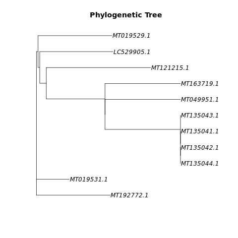

# Example Pipeline to retrieve candidates, calculate SNPs and a phylogenetic tree
This pipeline should show one option the get the necessary data to design upstream analysis independent of nextstrain data. 
It is more a cooking recipe than a whole full-featured analysis and there are still (a lot of) open ToDos. 

## Getting candidates
The candidates could be chosen by the researcher based on previous knowledge or by a BLAST against a database.
For demonstration purposes, I have chosen "genomic/Virueses/Betacoronavirus" and the reference sequence (MN908947.3). 

```
blastn -db genomic/Viruses/Betacoronavirus -query sequence.fasta -remote -out blast.out -outfmt "6 sseqid sgi sacc  pident length mismatch gapopen qstart qend sstart send evalue bitscore" -ungapped
```

For demonstration purposes and because of limited calculation power the first 15 candidates were selected and filtered. 
Of course, the selection can be much smarter, e.g. based on the BLAST result. 

With this awk one-liner, we are selecting the first 15 lines which are not identical to the query sequence.

```bash
awk -F " " 'NR <= 15{ if($4 != 100.00) printf $3" "}' blast.out > candidates.ids
```
In the next step, we will download the sequences from [NCBI](https://www.ncbi.nlm.nih.gov/). 

```bash
ncbi-acc-download -m nucleotide -F fasta --out candidates.fa $(cat candidates.ids)
```

## Sequence Alignment with virulign
### Multiple Alignment in fasta 
[virulign](https://github.com/rega-cev/virulign) can align the sequences and output a multiple alignment as fasta. It is also possible to disable insertions with --exportWithInsertions no

```bash
virulign sequence.fasta candidates.fa --exportKind GlobalAlignment  > alignment.mfa
```
From the [tutorial](https://github.com/rega-cev/virulign-tutorial): 

_The option MutationTable will create a CSV file where each mutation present at a specific position is given as a separate column in Boolean representation. The CSV file is annotated according to the numerical position in the protein (e.g., Table below)._

```bash
virulign sequence.fasta candidates.fa --exportKind MutationTable  > alignment_mutations.tab
```
It is also possible to make a table for each position

```bash
virulign sequence.fasta candidates.fa --exportKind PositionTable  > alignment_positions.tab
```

## Phylogenetic tree
By using R with libraries seqinr and ape we can calculate a phylogenetic tree out of our alignment. 
More resources here: [http://rforbiochemists.blogspot.com/2016/12/drawing-simple-phylogenetic-tree-of.html](http://rforbiochemists.blogspot.com/2016/12/drawing-simple-phylogenetic-tree-of.html),
[http://www.phytools.org/eqg/Exercise_3.2/
](http://www.phytools.org/eqg/Exercise_3.2/)

```R
library(seqinr)
library(ape)

myalg<-read.alignment("alignment.mfa", format = "fasta") #Read alignment
distances<- dist.alignment(myalg) #calculate distances in the alignment
myTree <- nj(distances) #generate tree

png("tree.png") #plot tree
plot(myTree, main="Phylogenetic Tree")
dev.off()
```


## Remarks
The information of the phylogenetic tree can be exported ([http://www.phytools.org/eqg/Exercise_3.2/](http://www.phytools.org/eqg/Exercise_3.2/)) and **may be used to calculate a table like** [here](https://github.com/poysh/idee1_hypervirome_project/tree/dev/data/processed) **which was used before in our project (this can be a ToDo in our project!).** 
### Next steps
A researcher can use this workflow as an idea for the data processing. The candidates can be exchanged, the tables and outputs can be an input for ML approaches. Also, the tables could be merged or more meta-data could be used. In addition, the used R packages provide much more functions and possibilites to work with the alignment.


virualigner also provides the option the define ORFs with an XML-file which could be beneficial when calculating SNPs. 

Another **ToDo** would be the mapping of the SNPs/Mutations to both the amino-acid sequence and the nucleotide-sequence. Maybe in combination with the blast result and the pipeline in [https://github.com/poysh/idee1_hypervirome_project/tree/dataset-prep/blast-to-snp/preprocess-data/blast-to-snp](https://github.com/poysh/idee1_hypervirome_project/tree/dataset-prep/blast-to-snp/preprocess-data/blast-to-snp)

It is also possible to construct and reconstruct the phylogenetic trees and compare them to the nextstrain phylogenetic tree. It would be easier when the outcome of this pipline is converted into our dataframe mentionend above.

### Usage
Copy sequence.fasta from data to a location with pipeline.sh and phylo_tree.R.
### Docker
A dockerfile which builds an ubuntu18.04 image is included. All necessary tools are installed to run the workflow. 
Short instructions: 

```bash
#build the container
docker build -t virulign-to-mutation .
#run the container
docker run -it --hostname localhost -i virulign-to-mutation /bin/bash
#if you want to modify the workflow, you can mount a local directory to the container including your data (sequence) and the scripts you want to run
#E.g. sequence.fasta, pipeline.sh, pyhlo_tree.R
#We mount your local data directory to /workspace in the container
#All outputfiles will be written in data on your local computer outside of the container. 
docker run -it --hostname localhost -v data:/workspace -i virulign-to-mutation /bin/bash
```

**Known bug**: viruligner can be killed because of limitation (security settings?) of the docker process.

Finally, I hope that this initial workflow can be useful to someone. 

